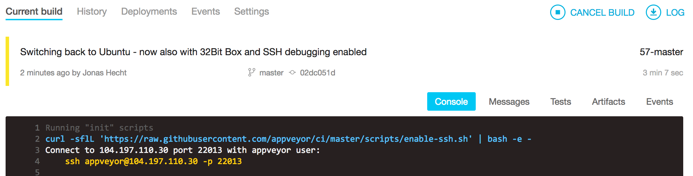
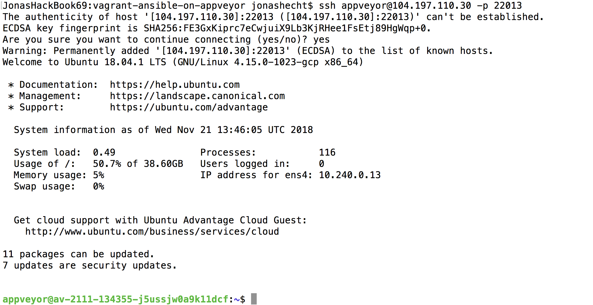

# vagrant-ansible-on-appveyor

[](https://ci.appveyor.com/project/jonashackt/vagrant-ansible-on-appveyor)

Example project showing how to install and use Vagrant on a "free" Cloud CI system to finally be able to use Ansible to configure the VagrantBox.


## Why Vagrant on a CI system?

I´d really want to test bigger Infrastructure-as-Code projects like https://github.com/jonashackt/kubernetes-the-ansible-way and therefore need Vagrant running on a CI system (I don´t want to setup or host the CI system myself).

And no, Docker-in-Docker won´t suffice here!

## Why not TravisCI (or CircleCI)?

Problem is: my beloved TravisCI doesn´t support Vagrant - see https://stackoverflow.com/questions/31828555/using-vagrant-on-cloud-ci-services

I really tested it out, just have a look into the first commits of this repository, you should find some links to Travis. Especially tried to switch all possible environments (see https://docs.travis-ci.com/user/reference/overview/#virtualisation-environment-vs-operating-system), but sadly none worked for me. Here´s the `.travis.yml` I ended up ([which didn´t work](https://travis-ci.org/jonashackt/vagrant-ansible-on-travisci/builds/456418110)):

```yaml
language: python
python: "2.7"

# virtualization environment (see https://docs.travis-ci.com/user/reference/overview/#virtualisation-environment-vs-operating-system)
# using the newest available Ubuntu on Travis
dist: xenial

# Install ansible
addons:
  apt:
    packages:
    - python-pip
    - linux-headers-generic
    - virtualbox-dkms
    - virtualbox

install:
  # Install ansible
  - pip install ansible
  # Check ansible version
  - ansible --version
  # Create ansible.cfg with correct roles_path
  - printf '[defaults]\nroles_path=../' >ansible.cfg
  - sudo dpkg-reconfigure virtualbox-dkms
  - sudo dpkg-reconfigure virtualbox
  - VBoxManage --version
  # Download Vagrant
  - sudo wget -nv https://releases.hashicorp.com/vagrant/2.2.1/vagrant_2.2.1_x86_64.deb
  # Install Vagrant package
  - sudo dpkg -i vagrant_2.2.1_x86_64.deb

script:
  - vagrant up
  - ansible-playbook playbook.yml -i hosts --syntax-check
  - ansible-playbook playbook.yml -i hosts

``` 
 
Main thing was this blog: https://www.lewuathe.com/travisci/vagrant/vagrant-in-travisci.html But I think it never worked in it´s just a perk.

Then I switched over to CircleCI, because I found some gists (https://github.com/critical-alert/circleci-vagrant/blob/master/circle.yml and https://gist.github.com/masutaka/2adfc24c8c220be292ea). Here´s my `circle.yml`:

```yaml
dependencies:
  cache_directories:
  - ~/.vagrant.d
  - ~/tmp
  pre:
  - |
    mkdir -p ~/tmp
    cd ~/tmp
    VERSION=2.2.1
    if [ ! -f vagrant_${VERSION}_x86_64.deb ]; then
      wget -nv https://releases.hashicorp.com/vagrant/${VERSION}/vagrant_${VERSION}_x86_64.deb
    fi
    sudo dpkg -i vagrant_${VERSION}_x86_64.deb

  - pip install ansible

test:
  pre:
  - vagrant up
  - ansible-playbook playbook.yml -i hosts --syntax-check
  - ansible-playbook playbook.yml -i hosts
  post:
  - vagrant destroy -f

```

But that [didn´t work either](https://circleci.com/gh/jonashackt/vagrant-ansible-on-travisci/1) - and CircleCI seems to have switched to Docker-based builds with it´s version 2 - so this configuration is legacy.

In the end I overlooked this comment here: https://stackoverflow.com/questions/31828555/using-vagrant-on-cloud-ci-services#comment71887941_32191959 and I started to test [AppVeyor](https://www.appveyor.com/), which I already heard from... Seems to be somehow Microsofty, but if it would be really capable of spinning up Vagrant boxes, I would run over with flying flags.


## Vagrant on AppVeyor

##### some good resources

https://help.appveyor.com/discussions/problems/1247-vagrant-not-working-inside-appveyor

--> conclusion: we need nested virtualization (VT-X) enabled. Since those machines aren't accessible for free in order to be able to use that, the AppVeyor team occasionally grants access for OpenSource projects:

https://help.appveyor.com/discussions/problems/22269-packer-build-fails-on-vboxmanage-error-vboxmanage-error-vt-x-is-not-available-verr_vmx_no_vmx

https://ci.appveyor.com/project/tknerr/vagrant-appveyor-testing/history

[Ubuntu Image specs on AppVeyor](https://www.appveyor.com/docs/linux-images-software/)

[appveyor.yml Reference](https://www.appveyor.com/docs/appveyor-yml/)


##### Ubuntu1804 image on AppVeyor

I really got far with my experiences based on the `Ubuntu1804` image, which is one of [the two available Linux images on AppVeyor](https://www.appveyor.com/docs/linux-images-software/):

```
version: '{build}-{branch}'
image: Ubuntu1804
init:
  - sudo apt-get -yq install python-pip virtualbox
  # How did the VirtualBox installation go?
  - VBoxManage --version
  - sudo pip install ansible
  # Ansible correctly installed?
  - ansible --version

install:
  # we have to download Vagrant in the install step (not init), because otherwise we´ll run into errors like
  # fatal: destination path '/home/appveyor/projects/vagrant-ansible-on-appveyor' already exists and is not an empty directory.
  # see https://help.appveyor.com/discussions/problems/2367-git-clone-fails-non-empty-dir
  - sudo wget -nv https://releases.hashicorp.com/vagrant/2.2.1/vagrant_2.2.1_x86_64.deb
  # Install Vagrant package
  - sudo dpkg -i vagrant_2.2.1_x86_64.deb
  # Vagrant correctly installed?
  - vagrant --version

build_script:
  - vagrant up
  - vagrant ssh -c "echo 'hello world!'"
  #|| ssh vagrant@127.0.0.1 -p 2222 -i .vagrant\machines\default\virtualbox\private_key -o StrictHostKeyChecking=no -o UserKnownHostsFile=/dev/null -vvv -C "pwd"
  #- vagrant ssh -c "uname -a"

test: off
test_script:
  - ansible-playbook playbook.yml -i hosts --syntax-check
```

Here´s a [link to a build](https://ci.appveyor.com/project/jonashackt/vagrant-ansible-on-appveyor/builds/20389334), where VirtualBox get´s downloaded, Vagrant successfully installed - and `vagrant up` gets executed:


As I constantly ran into timeouts in the end - and I´am realizing, that I install virtualization software into a virtual machine which can possibly run any OS - I can also give a AppVeyor Windows image a try, which [should reportly be able to do a full `vagrant up`](https://help.appveyor.com/discussions/problems/1247-vagrant-not-working-inside-appveyor) and may also run faster cause it´s based on Hyper-V, which is a [first class citizen on AppVeyor](https://www.appveyor.com/docs/build-environment/#hyper-v).


##### Visual Studio 2017 (Windows Server 2016) image on AppVeyor

So let´s switch [the base image](https://www.appveyor.com/docs/build-environment/#build-worker-images):

```
version: '1.0.{build}-{branch}'
image: Visual Studio 2017

# RDP Debugging
init:
- ps: iex ((new-object net.webclient).DownloadString('https://raw.githubusercontent.com/appveyor/ci/master/scripts/enable-rdp.ps1'))
#on_finish:
#- ps: $blockRdp = $true; iex ((new-object net.webclient).DownloadString('https://raw.githubusercontent.com/appveyor/ci/master/scripts/enable-rdp.ps1'))

cache:
- C:\ProgramData\chocolatey\lib
- C:\Vagrant
- C:\Users\appveyor\.vagrant.d

install:
# Disable Hyper-V
- dism.exe /Online /Disable-Feature:Microsoft-Hyper-V /Quiet
- ps: mkdir C:\Users\appveyor\.vagrant.d | Out-Null
  # Disable chocolatey´s verbose download output
- choco feature disable --name showDownloadProgress
- choco install virtualbox --yes
- ps: Start-FileDownload "https://releases.hashicorp.com/vagrant/2.2.1/vagrant_2.2.1_x86_64.msi"
- ps: Start-Process -FilePath "msiexec.exe" -ArgumentList "/a vagrant_2.2.1_x86_64.msi /qb TARGETDIR=C:\Vagrant" -Wait
- set PATH=C:\Vagrant\HashiCorp\Vagrant\bin;C:\VBox;%PATH%
# Vagrant correctly installed?
- vagrant --version
- ssh -V
- ipconfig /all

build_script:
- ps: Test-NetConnection google.com -Port 80
- vagrant up --debug
- vagrant ssh -c "echo 'hello world!'"
```

At first, we need to disable Hyper-V - because this would collide with VirtualBox and results in failed startups of our Vagrant Boxes:

```
==> ubuntu: Forwarding ports...
    ubuntu: 22 (guest) => 2222 (host) (adapter 1)
==> ubuntu: Running 'pre-boot' VM customizations...
==> ubuntu: Booting VM...
There was an error while executing `VBoxManage`, a CLI used by Vagrant
for controlling VirtualBox. The command and stderr is shown below.
Command: ["startvm", "f0b5eed7-7f46-46fa-a9b5-7c8c4ba7d93e", "--type", "headless"]
Stderr: VBoxManage.exe: error: Raw-mode is unavailable courtesy of Hyper-V. (VERR_SUPDRV_NO_RAW_MODE_HYPER_V_ROOT)
VBoxManage.exe: error: Details: code E_FAIL (0x80004005), component ConsoleWrap, interface IConsole
```

We do this with the help of `dism`, the PowerShell comands like `Disable-WindowsOptionalFeature` doesn´t seem to work with Hyper-V on AppVeyor, so we go with:

```
- dism.exe /Online /Disable-Feature:Microsoft-Hyper-V /Quiet
```

You may note, that AppVeyor also supports reboots of build workers - the `/Quiet` option prevents us from errors and `/Disable-Feature:Microsoft-Hyper-V` reboots the worker finally after removing Hyper-V.

For installing VirtualBox, we´re using chocolatey for it´s ease of use here. Sadly that´s not possible for Vagrant. After problems with the chocolatey Vagrant installation (see https://github.com/chocolatey/chocolatey-coreteampackages/issues/1099 & https://github.com/chocolatey/chocolatey-coreteampackages/pull/1109), I needed to download and install Vagrant manually.

##### RDP into a running AppVeyor build worker

It´s almost crazy what AppVeyor allows you to do: You can really connect into a worker via RDP (in case of a Windows image)! This is documented here: https://www.appveyor.com/docs/how-to/rdp-to-build-worker/ All you have to do is:

1. Go to settings of your AppVeyor project and head over to `Environment`
2. Create a new Environment variable `APPVEYOR_RDP_PASSWORD` and insert a (min. 6 long, UPPER and lower case password, with one non-alphanumeric character) password
3. Add `- ps: iex ((new-object net.webclient).DownloadString('https://raw.githubusercontent.com/appveyor/ci/master/scripts/enable-rdp.ps1'))` to your `init` section.
4. Push your code and the IP/Port & username will be printed in the build log for you:

 

Use these infos to connect via your favorite RDP client! Now you can watch things get installed and configured:


##### SSH into your AppVeyor Ubuntu worker

There´s also a way to SSH into the workers, see https://www.appveyor.com/docs/how-to/ssh-to-build-worker/

Add the following 2 environment variables:

`APPVEYOR_SSH_KEY` containing your public key as the value
`APPVEYOR_SSH_BLOCK` set to `true` 

and add the following line to your `init` phase inside the `appveyor.yml`:

```
init:
- sh: curl -sflL 'https://raw.githubusercontent.com/appveyor/ci/master/scripts/enable-ssh.sh' | bash -e -
```

Now after starting the build, you should get all the infos needed to connect to the worker via SSH:



Just execute the ssh command and you´re in:



A really helpful ressource on how to debug the VirtualBox startup on Linux provides this link: https://blogs.oracle.com/scoter/virtualbox-log-files-v2

Have a look into `~/VirtualBox VMs/ubuntu/Logs$` inside the ssh session on the AppVeyor worker and do a `tail VBox.log -f`.


##### Latest state

I couldn´t manage to 100% fire up a Vagrant box, the farest I got, was on Ubuntu image, the boot sequence seemed to hang in this state (from `VBox.log`):

```
00:00:00.259909 Physical Core Count:             1
00:00:00.259913 
00:00:00.259914 ******************** End of CPUID dump **********************
00:00:00.274624 PcBios: SATA LUN#0 LCHS=1024/255/63
00:00:00.274648 APIC: fPostedIntrsEnabled=false fVirtApicRegsEnabled=false fSupportsTscDeadline=false
00:00:00.274657 TMR3UtcNow: nsNow=1 542 816 026 895 553 000 nsPrev=0 -> cNsDelta=1 542 816 026 895 553 000 (offLag=0 offVirtualSync=0 offVirtualSyncGivenUp=0, NowAgain=1 542 816 026 895 554 000)
00:00:00.274681 VMEmt: Halt method global1 (5)
00:00:00.274688 VMEmt: HaltedGlobal1 config: cNsSpinBlockThresholdCfg=2000
00:00:00.274693 Changing the VM state from 'CREATING' to 'CREATED'
00:00:00.277005 Changing the VM state from 'CREATED' to 'POWERING_ON'
00:00:00.277257 Changing the VM state from 'POWERING_ON' to 'RUNNING'
00:00:00.277267 Console: Machine state changed to 'Running'
00:00:00.281612 VMMDev: Guest Log: BIOS: VirtualBox 5.2.22
00:00:00.281847 PCI: setting up resources and interrupts
00:00:00.282270 PIT: mode=2 count=0x10000 (65536) - 18.20 Hz (ch=0)
00:00:00.294265 VMMDev: Guest Log: CPUID EDX: 0x078bf3ff
00:00:00.297294 AHCI#0: Reset the HBA
00:00:00.297311 VD#0: Cancelling all active requests
00:00:00.297965 AHCI#0: Port 0 reset
00:00:00.298005 VD#0: Cancelling all active requests
00:00:00.299577 VMMDev: Guest Log: BIOS: AHCI 0-P#0: PCHS=16383/16/63 LCHS=1024/255/63 0x0000000005000000 sectors
00:00:00.301688 PIT: mode=2 count=0x48d3 (18643) - 64.00 Hz (ch=0)
00:00:00.305478 Display::handleDisplayResize: uScreenId=0 pvVRAM=00007fb164032000 w=640 h=480 bpp=32 cbLine=0xA00 flags=0x0
00:00:00.859685 NAT: Old socket recv size: 128KB
00:00:00.859711 NAT: Old socket send size: 128KB
00:00:02.773231 Display::handleDisplayResize: uScreenId=0 pvVRAM=0000000000000000 w=720 h=400 bpp=0 cbLine=0x0 flags=0x0
00:00:02.774471 PIT: mode=2 count=0x10000 (65536) - 18.20 Hz (ch=0)
00:00:02.774737 VMMDev: Guest Log: BIOS: Boot : bseqnr=1, bootseq=0002
00:00:02.775511 VMMDev: Guest Log: BIOS: Booting from Hard Disk...
00:00:09.499490 PIT: mode=2 count=0x12a5 (4773) - 249.98 Hz (ch=0)
00:00:09.576961 PATM: Disable block at c10127b0 - write c10127e1-c10127e5
00:00:09.577106 PATM: Disable block at c10129a0 - write c1012a3c-c1012a3d
00:00:11.392679 PATM: Disable block at c1675a3c - write c1675399-c167539a
00:00:11.392729 PATM: Disabling IDT 0 patch handler c1675a3c
00:00:11.392735 PATM: Disable block at c16759d4 - write c1675399-c167539a
00:00:11.392738 PATM: Disabling IDT 4 patch handler c16759d4
00:00:11.392743 PATM: Disable block at c16759e4 - write c1675399-c167539a
00:00:11.392745 PATM: Disabling IDT 5 patch handler c16759e4
00:00:11.392750 PATM: Disable block at c16759f4 - write c1675399-c167539a
00:00:11.392800 PATM: Disabling IDT 6 patch handler c16759f4
00:00:11.392806 PATM: Disable block at c16759bc - write c1675399-c167539a
00:00:11.392810 PATM: Disabling IDT 7 patch handler c16759bc
00:00:11.392816 PATM: Disable block at c1675a00 - write c1675399-c167539a
00:00:11.392820 PATM: Disabling IDT 9 patch handler c1675a00
00:00:11.392826 PATM: Disable block at c1675a0c - write c1675399-c167539a
00:00:11.392830 PATM: Disabling IDT a patch handler c1675a0c
00:00:11.392834 PATM: Disable block at c1675a18 - write c1675399-c167539a
00:00:11.392838 PATM: Disabling IDT b patch handler c1675a18
00:00:11.392842 PATM: Disable block at c1675a24 - write c1675399-c167539a
00:00:11.392845 PATM: Disabling IDT c patch handler c1675a24
00:00:11.392849 PATM: Disable block at c1675cb0 - write c1675399-c167539a
00:00:11.392852 PATM: Disabling IDT d patch handler c1675cb0
00:00:11.392856 PATM: Disable block at c1675a70 - write c1675399-c167539a
00:00:11.392859 PATM: Disabling IDT e patch handler c1675a70
00:00:11.392863 PATM: Disable block at c1675a58 - write c1675399-c167539a
00:00:11.392866 PATM: Disabling IDT f patch handler c1675a58
00:00:11.392871 PATM: Disable block at c167599c - write c1675399-c167539a
00:00:11.392874 PATM: Disabling IDT 10 patch handler c167599c
00:00:11.392880 PATM: Disable block at c1675a30 - write c1675399-c167539a
00:00:11.392883 PATM: Disabling IDT 11 patch handler c1675a30
00:00:11.392888 PATM: Disable block at c1675a48 - write c1675399-c167539a
00:00:11.392891 PATM: Disabling IDT 12 patch handler c1675a48
00:00:11.392895 PATM: Disable block at c16759ac - write c1675399-c167539a
00:00:11.392898 PATM: Disabling IDT 13 patch handler c16759ac
00:00:12.172903 PIT: mode=0 count=0x10000 (65536) - 18.20 Hz (ch=0)
```

On Windows the log ended much earlier :( - both on Windows Server 2016 & 2012