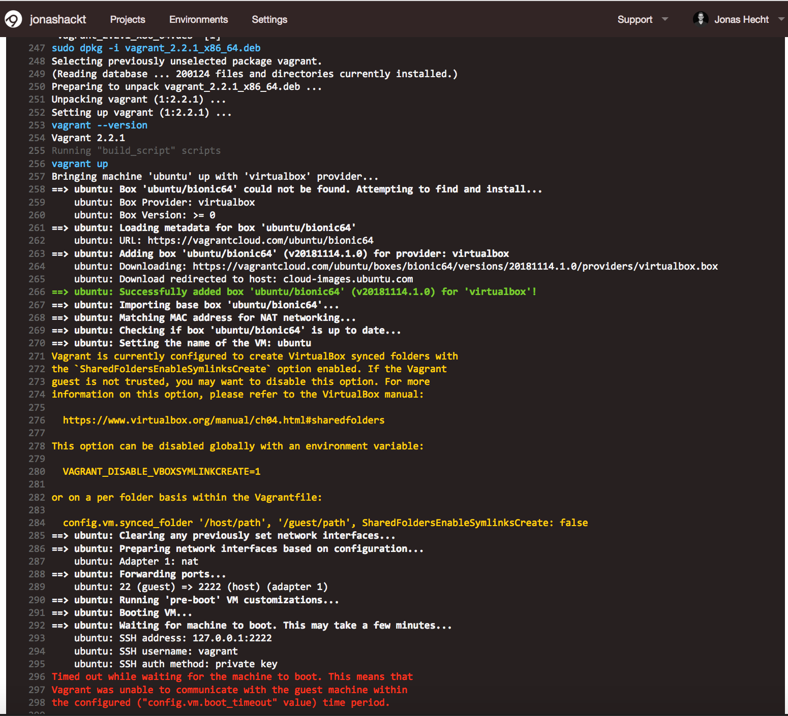
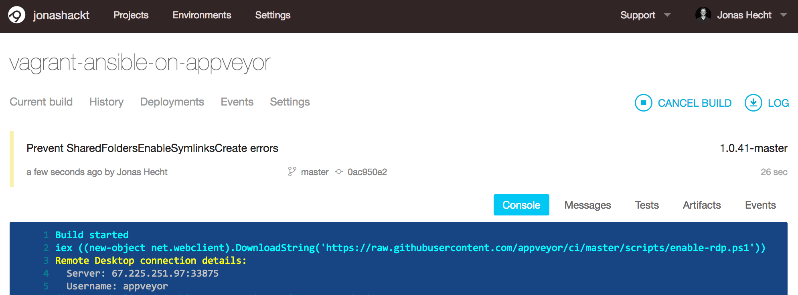

# vagrant-ansible-on-travisci

[](https://ci.appveyor.com/project/jonashackt/vagrant-ansible-on-appveyor)

Example project showing how to install and use Vagrant on TravisCI and how to use a Ansible playbook to connect to the running Vagrant Box inside Travis


## Why Vagrant on a CI system?

I´d really want to test bigger Infrastructure-as-Code projects like https://github.com/jonashackt/kubernetes-the-ansible-way and therefore need Vagrant running on a CI system (I don´t want to setup or host the CI system myself).

And no, Docker-in-Docker won´t suffice here!

## Why not TravisCI (or CircleCI)?

Problem is: my beloved TravisCI doesn´t support Vagrant - see https://stackoverflow.com/questions/31828555/using-vagrant-on-cloud-ci-services

I really tested it out, just have a look into the first commits of this repository, you should find some links to Travis. Especially tried to switch all possible environments (see https://docs.travis-ci.com/user/reference/overview/#virtualisation-environment-vs-operating-system), but sadly none worked for me. Here´s the `.travis.yml` I ended up ([which didn´t work](https://travis-ci.org/jonashackt/vagrant-ansible-on-travisci/builds/456418110)):

```yaml
language: python
python: "2.7"

# virtualization environment (see https://docs.travis-ci.com/user/reference/overview/#virtualisation-environment-vs-operating-system)
# using the newest available Ubuntu on Travis
dist: xenial

# Install ansible
addons:
  apt:
    packages:
    - python-pip
    - linux-headers-generic
    - virtualbox-dkms
    - virtualbox

install:
  # Install ansible
  - pip install ansible
  # Check ansible version
  - ansible --version
  # Create ansible.cfg with correct roles_path
  - printf '[defaults]\nroles_path=../' >ansible.cfg
  - sudo dpkg-reconfigure virtualbox-dkms
  - sudo dpkg-reconfigure virtualbox
  - VBoxManage --version
  # Download Vagrant
  - sudo wget -nv https://releases.hashicorp.com/vagrant/2.2.1/vagrant_2.2.1_x86_64.deb
  # Install Vagrant package
  - sudo dpkg -i vagrant_2.2.1_x86_64.deb

script:
  - vagrant up
  - ansible-playbook playbook.yml -i hosts --syntax-check
  - ansible-playbook playbook.yml -i hosts

``` 
 
Main thing was this blog: https://www.lewuathe.com/travisci/vagrant/vagrant-in-travisci.html But I think it never worked in it´s just a perk.

Then I switched over to CircleCI, because I found some gists (https://github.com/critical-alert/circleci-vagrant/blob/master/circle.yml and https://gist.github.com/masutaka/2adfc24c8c220be292ea). Here´s my `circle.yml`:

```yaml
dependencies:
  cache_directories:
  - ~/.vagrant.d
  - ~/tmp
  pre:
  - |
    mkdir -p ~/tmp
    cd ~/tmp
    VERSION=2.2.1
    if [ ! -f vagrant_${VERSION}_x86_64.deb ]; then
      wget -nv https://releases.hashicorp.com/vagrant/${VERSION}/vagrant_${VERSION}_x86_64.deb
    fi
    sudo dpkg -i vagrant_${VERSION}_x86_64.deb

  - pip install ansible

test:
  pre:
  - vagrant up
  - ansible-playbook playbook.yml -i hosts --syntax-check
  - ansible-playbook playbook.yml -i hosts
  post:
  - vagrant destroy -f

```

But that [didn´t work either](https://circleci.com/gh/jonashackt/vagrant-ansible-on-travisci/1) - and CircleCI seems to have switched to Docker-based builds with it´s version 2 - so this configuration is legacy.

In the end I overlooked this comment here: https://stackoverflow.com/questions/31828555/using-vagrant-on-cloud-ci-services#comment71887941_32191959 and I started to test [AppVeyor](https://www.appveyor.com/), which I already heard from... Seems to be somehow Microsofty, but if it would be really capable of spinning up Vagrant boxes, I would run over with flying flags.


## Vagrant on AppVeyor

##### some good resources

https://help.appveyor.com/discussions/problems/1247-vagrant-not-working-inside-appveyor

https://ci.appveyor.com/project/tknerr/vagrant-appveyor-testing/history

[Ubuntu Image specs on AppVeyor](https://www.appveyor.com/docs/linux-images-software/)

[appveyor.yml Reference](https://www.appveyor.com/docs/appveyor-yml/)


##### Ubuntu1804 image on AppVeyor

I really got far with my experiences based on the `Ubuntu1804` image, which is one of [the two available Linux images on AppVeyor](https://www.appveyor.com/docs/linux-images-software/):

```
version: '{build}-{branch}'
image: Ubuntu1804
init:
  - sudo apt-get -yq install python-pip virtualbox
  # How did the VirtualBox installation go?
  - VBoxManage --version
  - sudo pip install ansible
  # Ansible correctly installed?
  - ansible --version

install:
  # we have to download Vagrant in the install step (not init), because otherwise we´ll run into errors like
  # fatal: destination path '/home/appveyor/projects/vagrant-ansible-on-appveyor' already exists and is not an empty directory.
  # see https://help.appveyor.com/discussions/problems/2367-git-clone-fails-non-empty-dir
  - sudo wget -nv https://releases.hashicorp.com/vagrant/2.2.1/vagrant_2.2.1_x86_64.deb
  # Install Vagrant package
  - sudo dpkg -i vagrant_2.2.1_x86_64.deb
  # Vagrant correctly installed?
  - vagrant --version

build_script:
  - vagrant up
  - vagrant ssh -c "echo 'hello world!'"
  #|| ssh vagrant@127.0.0.1 -p 2222 -i .vagrant\machines\default\virtualbox\private_key -o StrictHostKeyChecking=no -o UserKnownHostsFile=/dev/null -vvv -C "pwd"
  #- vagrant ssh -c "uname -a"

test: off
test_script:
  - ansible-playbook playbook.yml -i hosts --syntax-check
```

Here´s a [link to a build](https://ci.appveyor.com/project/jonashackt/vagrant-ansible-on-appveyor/builds/20389334), where VirtualBox get´s downloaded, Vagrant successfully installed - and `vagrant up` gets executed:



As I constantly ran into timeouts in the end - and I´am realizing, that I install virtualization software into a virtual machine which can possibly run any OS - I can also give a AppVeyor Windows image a try, which [should reportly be able to do a full `vagrant up`](https://help.appveyor.com/discussions/problems/1247-vagrant-not-working-inside-appveyor) and may also run faster cause it´s based on Hyper-V, which is a [first class citizen on AppVeyor](https://www.appveyor.com/docs/build-environment/#hyper-v).


##### Visual Studio 2017 (Windows Server 2016) image on AppVeyor

So let´s switch [the base image](https://www.appveyor.com/docs/build-environment/#build-worker-images):

```
version: '{build}-{branch}'
image: Visual Studio 2017

init:
# Disable Hyper-V
- dism.exe /Online /Disable-Feature:Microsoft-Hyper-V /Quiet
- ps: mkdir C:\Users\appveyor\.vagrant.d | Out-Null
  # Disable chocolatey´s verbose download output
- choco feature disable --name showDownloadProgress
- choco install virtualbox --yes

install:
- ps: Start-FileDownload "https://releases.hashicorp.com/vagrant/2.2.1/vagrant_2.2.1_x86_64.msi"
- ps: Start-Process -FilePath "msiexec.exe" -ArgumentList "/a vagrant_2.2.1_x86_64.msi /qb TARGETDIR=C:\Vagrant" -Wait
- set PATH=C:\Vagrant\HashiCorp\Vagrant\bin;C:\VBox;%PATH%
# Vagrant correctly installed?
- vagrant --version
- ssh -V
- ipconfig /all

build_script:
- ps: Test-NetConnection google.com -Port 80
- vagrant up
- vagrant ssh -c "echo 'hello world!'"
```

At first, we need to disable Hyper-V - because this would collide with VirtualBox and results in failed startups of our Vagrant Boxes:

```
==> ubuntu: Forwarding ports...
    ubuntu: 22 (guest) => 2222 (host) (adapter 1)
==> ubuntu: Running 'pre-boot' VM customizations...
==> ubuntu: Booting VM...
There was an error while executing `VBoxManage`, a CLI used by Vagrant
for controlling VirtualBox. The command and stderr is shown below.
Command: ["startvm", "f0b5eed7-7f46-46fa-a9b5-7c8c4ba7d93e", "--type", "headless"]
Stderr: VBoxManage.exe: error: Raw-mode is unavailable courtesy of Hyper-V. (VERR_SUPDRV_NO_RAW_MODE_HYPER_V_ROOT)
VBoxManage.exe: error: Details: code E_FAIL (0x80004005), component ConsoleWrap, interface IConsole
```

We do this with the help of `dism`, the PowerShell comands like `Disable-WindowsOptionalFeature` doesn´t seem to work with Hyper-V on AppVeyor, so we go with:

```
- dism.exe /Online /Disable-Feature:Microsoft-Hyper-V /Quiet
```

You may note, that AppVeyor also supports reboots of build workers - the `/Quiet` option prevents us from errors and `/Disable-Feature:Microsoft-Hyper-V` reboots the worker finally after removing Hyper-V.

For installing VirtualBox, we´re using chocolatey for it´s ease of use here. Sadly that´s not possible for Vagrant. After problems with the chocolatey Vagrant installation (see https://github.com/chocolatey/chocolatey-coreteampackages/issues/1099 & https://github.com/chocolatey/chocolatey-coreteampackages/pull/1109), I needed to download and install Vagrant manually.

##### RDP into a running AppVeyor build worker

It´s almost crazy what AppVeyor allows you to do: You can really connect into a worker via RDP (in case of a Windows image)! This is documented here: https://www.appveyor.com/docs/how-to/rdp-to-build-worker/ All you have to do is:

1. Go to settings of your AppVeyor project and head over to `Environment`
2. Create a new Environment variable `APPVEYOR_RDP_PASSWORD` and insert a (min. 6 long, UPPER and lower case password, with one non-alphanumeric character) password
3. Add `- ps: iex ((new-object net.webclient).DownloadString('https://raw.githubusercontent.com/appveyor/ci/master/scripts/enable-rdp.ps1'))` to your `init` section.
4. Push your code and the IP/Port & username will be printed in the build log for you:

 

Use these infos to connect via your favorite RDP client! Now you can watch things get installed and configured:


